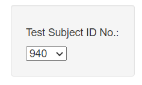
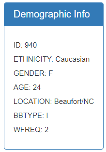
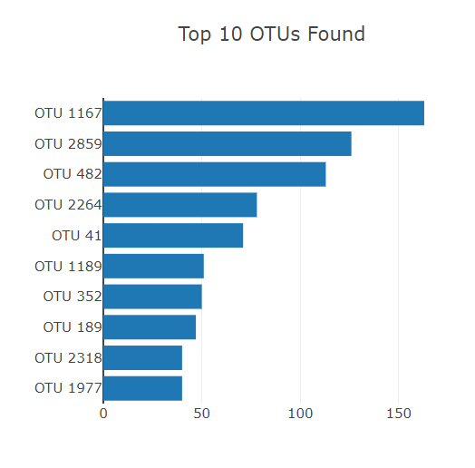
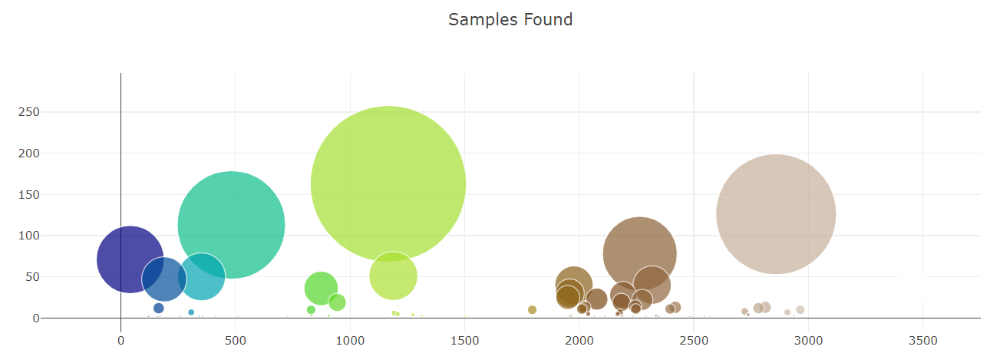

# belly-button-challenge
## Module 14 Challenge
For this project I used JavaScript, HTML, and the D3 library to create a dashboard with interactive charts to explore the Belly Button Biodiversity dataset which catalogs the microbes that colonize human navels. You can view the completed dashboard [here](https://isabellajade.github.io/belly-button-challenge/).

## Drop Down Menu
I created a drop down menu that contains that identification numbers of each individual in the study. Selecting a new ID changes the following charts on the page when selected.

## Demographic Information
I displayed the demographic information of each of the participants of the study, this will also change when a new ID is selected.

## Horizontal Bar Chart
I created a horizontal bar chart with a dropdown menu to display the top 10 OTUs found in each specificly selected individual.

## Bubble Chart
I created a bubble chart that displays each sample for the individual selected.

## Citations
Data for this project was conducted by The Public Science Lab, Department of Applied Ecology at North Carolina State University which can be viewed [here](http://robdunnlab.com/projects/belly-button-biodiversity/results-and-data/).